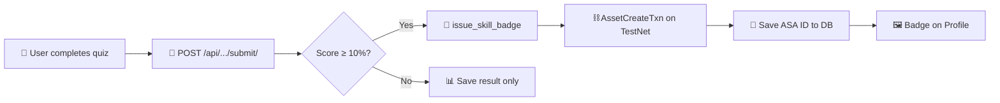

<div align="center">

<!-- Animated Header Banner -->


<!-- Animated Typing -->
<a href="https://git.io/typing-svg"></a>

<br/>

<!-- Shields Badges -->
[](https://algorand.co)
[](https://developer.algorand.org/algokit/)
[](https://react.dev)
[](https://djangoproject.com)
[](https://ai.google.dev)

<br/>

[](https://testnet.algoexplorer.io)
[](LICENSE)
[](https://rift.com)

</div>

---

> **🏆 RIFT 2026 Hackathon · Web3 / Blockchain Open Innovation Track · Build on Algorand**

**SkillMeter.ai** is an AI-powered learning platform that issues **verifiable skill credentials on the Algorand blockchain**. Every completed course earns a Certificate NFT, every passed assessment earns a Skill Badge NFT, and every learning action earns `$SKILL` tokens — all on Algorand TestNet.

---

## 🔴 Live Demo

<div align="center">

| | Link |
|:---:|:---|
| 🌐 **Frontend** | [**rift-skillmeter.vercel.app**](https://rift-skillmeter.vercel.app) |
| 🔧 **Backend API** | [**riftskillmeter-production.up.railway.app**](https://riftskillmeter-production.up.railway.app) |
| 🎥 **Demo Video** | [**Watch on Google Drive**](https://drive.google.com/drive/folders/1HZYGeW3BB8Vy2QE-vAF9OX0AAbF3b6Sd) |
| 💼 **LinkedIn Post** | [**View on LinkedIn**](https://www.linkedin.com/posts/omshinde80_blockchain-ai-web3-activity-7430439684587188224-iSXc) |

</div>

---

## 📌 Problem Statement

### 💡 The EdTech Gap: Structured Learning Ends Where Curiosity Begins

Today's edtech landscape is saturated with platforms for technical, professional, and soft-skill training — but they all share the same blind spot:

> **What about the skills you *want* to learn, but no structured course exists for?**

Whether it's urban farming, indie game sound design, or Vedic mathematics — learners are left piecing together scattered YouTube videos and blog posts with **zero recognition** for their effort.

Meanwhile, even on mainstream platforms, certificates are just PDFs — easily forged, impossible to verify automatically, and not portable across employers or institutions. **Learners earn nothing tangible. Employers can't trust what they see.**

### 🚀 Our Solution

**We propose SkillMeter.ai — a revolution in edtech, powered by AI and Algorand.**

SkillMeter uses **AI to generate structured courses for *any* skill** (not just pre-built catalog items), and issues **immutable ARC-69 NFTs on the Algorand blockchain** for every milestone — turning learning achievements into on-chain credentials that anyone can verify instantly via a public URL, with no login required.

<div align="center">

```
📝 Quiz Passed  →  🏅 Skill Badge NFT minted
📚 Course Done  →  🎓 Certificate NFT minted
💡 Daily Learn  →  💰 $SKILL Tokens earned
```

</div>

---

## ⛓️ On-Chain Features

<div align="center">

| | Feature | What Happens | On-Chain Proof |
|:---:|:---|:---|:---|
| 🏅 | **Skill Badge NFT** | Minted when learner scores ≥ 10% on any quiz | ARC-69 NFT on Algorand TestNet |
| 🎓 | **Certificate NFT** | Minted when learner completes 100% of a course | ARC-69 NFT — publicly verifiable |
| 💰 | **$SKILL Tokens** | Earned for daily learning, completing concepts, tasks, quiz attempts | ASA token transfer |

</div>

---

## 🔗 Algorand TestNet Deployments

<div align="center">

| Contract | App ID | Explorer |
|:---|:---:|:---|
| 🔐 **SkillCredential** (Certificate NFT) | `755783876` | [🔍 View on Lora](https://lora.algokit.io/testnet/application/755783876) |
| 🏅 **SkillBadge** (Assessment Badge) | `755783900` | [🔍 View on Lora](https://lora.algokit.io/testnet/application/755783900) |
| 💰 **$SKILL Token** (ASA) | `755783670` | [🔍 View on Lora](https://lora.algokit.io/testnet/asset/755783670) |

</div>

> **Admin Wallet:** `IGKF6PEEDZXTHPT35WBBXVCWBESHGJOHYJVONSUYO4NRSSPKPENRAO6NWU`

---

## 🏗️ Architecture Overview

```
┌──────────────────────┐     ┌───────────────────────┐     ┌─────────────────────┐
│   React Frontend     │────▶│  Django REST Backend   │────▶│  Algorand TestNet   │
│  (Vite + shadcn/ui)  │     │  (DRF + AlgoKit)       │     │  (AlgoNode.cloud)   │
└──────────────────────┘     └───────────────────────┘     └─────────────────────┘
         │                            │                              │
         │  GET /api/assessments/     │  AlgorandService             │
         │  POST /api/.../submit/     │  .issue_skill_badge()        │  AssetCreateTxn
         │  GET /verify?id=<cert>     │  .issue_certificate_nft()   ──▶  ARC-69 NFT minted
         │                            │  .reward_skill_tokens()      │  ASA transfer
         │                            │                              │
         ▼                            ▼                              ▼
   Profile.jsx                 AlgorandService               Algorand Indexer
   Badge Gallery          (algokit_utils + algosdk)    testnet-idx.algonode.cloud
   $SKILL Balance                                        (live balance query)
```

### Smart Contract Interaction Flow



---

## 🛠️ Tech Stack

<div align="center">

| Layer | Technology | Purpose |
|:---:|:---|:---|
| ⛓️ | **AlgoKit v2.10.2** | Algorand development framework |
| ⛓️ | **algokit-utils ≥ 3.0** | `AlgorandClient.testnet()` client management |
| ⛓️ | **algosdk** | Transaction primitives (`AssetCreateTxn`, `AssetTransferTxn`) |
| ⛓️ | **Algopy (Python)** | Smart contract language for `SkillCredential` & `SkillBadge` |
| 🔧 | **Django 5.2+** | REST API backend |
| 🔧 | **Django REST Framework** | API endpoints & JWT auth |
| 🔧 | **Daphne (ASGI)** | Production async server |
| 🧠 | **Google Gemini API** | AI course generation, notes, quizzes |
| ⚛️ | **React + Vite** | SPA frontend |
| 🎨 | **shadcn/ui + Tailwind** | Component library & styling |
| ✨ | **Framer Motion** | Animations & transitions |

</div>

---

## ⚙️ Installation & Setup

<details>
<summary><b>📦 Prerequisites</b></summary>

- Python 3.11+
- Node.js 18+
- AlgoKit CLI: `pipx install algokit`

</details>

<details>
<summary><b>🔧 Backend Setup</b></summary>

```bash
cd backend
python -m venv venv
venv\Scripts\activate          # Windows
pip install -r requirements.txt

# Copy and fill environment variables
cp .env.example .env
# Edit .env — set ALGORAND_MNEMONIC, API keys, etc.

python manage.py migrate
python manage.py runserver 8001
```

</details>

<details>
<summary><b>⚛️ Frontend Setup</b></summary>

```bash
# From project root
npm install

# Copy and fill environment variables
cp .env.example .env
# Set VITE_API_URL=http://localhost:8001/api

npm run dev
```

</details>

<details>
<summary><b>⛓️ Smart Contract Setup (AlgoKit)</b></summary>

```bash
cd smart_contracts/projects/smart_contracts
algokit bootstrap all
algokit deploy --network testnet
```

</details>

---

## 🔑 Environment Variables

<details>
<summary><b>Backend (<code>backend/.env</code>)</b></summary>

```env
SECRET_KEY=your-django-secret-key
DEBUG=False
ALLOWED_HOSTS=*

# Algorand (required for blockchain features)
ALGORAND_MNEMONIC=word1 word2 ... word25
ALGORAND_CERT_APP_ID=755783876
ALGORAND_BADGE_APP_ID=755783900
ALGORAND_SKILL_TOKEN_ID=755783670

# AI Services
GEMINI_API_KEY=your-gemini-key
YOUTUBE_API_KEY=your-youtube-key

# Email (optional — for certificate notification)
EMAIL_HOST_USER=your-gmail@gmail.com
EMAIL_HOST_PASSWORD=your-app-password

# WhatsApp (optional)
TWILIO_ACCOUNT_SID=your-sid
TWILIO_AUTH_TOKEN=your-token
TWILIO_WHATSAPP_NUMBER=whatsapp:+14155238886
```

</details>

<details>
<summary><b>Frontend (<code>.env</code>)</b></summary>

```env
VITE_API_URL=https://your-backend-url.railway.app/api
```

</details>

---

## 📖 Usage Guide

<table>
<tr>
<td width="50">1️⃣</td>
<td><b>Register & Onboard</b><br/>Sign up → select your skill level → the AI generates a personalized course with real YouTube videos</td>
</tr>
<tr>
<td>2️⃣</td>
<td><b>Learn</b><br/>Watch videos → read AI-generated notes → take quizzes. Each action earns <code>$SKILL</code> tokens</td>
</tr>
<tr>
<td>3️⃣</td>
<td><b>Earn NFT Badges</b><br/>Score ≥ 10% on any quiz → a <b>Skill Badge NFT</b> is minted to your Algorand wallet</td>
</tr>
<tr>
<td>4️⃣</td>
<td><b>Complete a Course → Certificate NFT</b><br/>Reach 100% progress → download PDF → <b>ARC-69 Certificate NFT</b> minted on Algorand TestNet</td>
</tr>
<tr>
<td>5️⃣</td>
<td><b>Verify Credentials</b><br/>Share your certificate link — anyone can verify on-chain, no login needed</td>
</tr>
<tr>
<td>6️⃣</td>
<td><b>Connect Your Wallet</b><br/>Profile → Algorand Wallet → paste your 58-char address → NFTs minted automatically</td>
</tr>
</table>

---

## 🔍 On-Chain Verification

Every certificate and badge is verifiable on the Algorand TestNet explorer:

| Asset | Explorer Link |
|:---|:---|
| 🎓 Certificate NFT | `https://lora.algokit.io/testnet/asset/<nft_asset_id>` |
| 🏅 Skill Badge NFT | `https://lora.algokit.io/testnet/asset/<badge_asset_id>` |
| 💰 $SKILL Token | [View on Lora](https://lora.algokit.io/testnet/asset/755783670) |
| 🔐 SkillCredential Contract | [View on Lora](https://lora.algokit.io/testnet/application/755783876) |
| 🏅 SkillBadge Contract | [View on Lora](https://lora.algokit.io/testnet/application/755783900) |

---

## 🚀 Deployment

<table>
<tr>
<td width="50%">

### Railway (Backend)

1. Connect GitHub repo to [Railway](https://railway.app)
2. Set root directory to `backend/`
3. Add all environment variables from `backend/.env`
4. Railway auto-detects `railway.json` — deploys via `daphne`

</td>
<td width="50%">

### Vercel (Frontend)

1. Connect GitHub repo to [Vercel](https://vercel.com)
2. Set root directory to project root
3. Add `VITE_API_URL` pointing to your backend URL
4. Vercel auto-detects `vercel.json`

</td>
</tr>
</table>

---

## ⚠️ Known Limitations

| # | Limitation | Detail |
|:---:|:---|:---|
| 1 | **Wallet opt-in required** | Users must opt-in to ASA `755783670` before receiving `$SKILL` tokens |
| 2 | **TestNet only** | All deployments on Algorand TestNet. MainNet requires funded admin wallet |
| 3 | **Badge threshold** | Set to ≥ 10% for testing. Production should be ≥ 70% |
| 4 | **Admin minting** | NFTs minted from admin wallet (custodial). Production would use escrow |
| 5 | **Video API quota** | YouTube Data API has daily limits. Fallback to search URLs when exceeded |

---

## 👥 Team

<div align="center">

| | |
|:---:|:---:|
| **Dhiraj Dahale** | **Om Shinde** |
| **Anant Pagar** | |

</div>

---

## 📁 Project Structure

<details>
<summary>Click to expand</summary>

```
AiBoomiSkillMeter/
├── backend/                    # Django REST API
│   ├── api/
│   │   ├── models.py           # Data models (with Algorand fields)
│   │   ├── views.py            # API views + Algorand hooks
│   │   ├── services.py         # AlgorandService (AlgoKit + algosdk)
│   │   ├── serializers.py      # DRF serializers
│   │   ├── badge_generator.py  # Pillow badge PNG generator
│   │   └── urls.py             # URL routing
│   ├── railway.json            # Railway deployment config
│   └── requirements.txt
├── smart_contracts/            # AlgoKit project
│   └── projects/smart_contracts/
│       ├── skill_credential/
│       │   └── contract.py     # ARC-4 SkillCredential contract (Algopy)
│       └── skill_badge/
│           └── contract.py     # ARC-4 SkillBadge contract (Algopy)
├── src/                        # React frontend
│   ├── pages/
│   │   ├── Learn.jsx           # Learning + quiz + badge minting
│   │   ├── Profile.jsx         # Badge gallery + wallet + $SKILL
│   │   ├── Dashboard.jsx       # Live $SKILL balance from Indexer
│   │   └── VerifyCertificate.jsx  # Public on-chain cert verification
│   └── contexts/
│       ├── AuthContext.jsx
│       └── LearningContext.jsx
├── scripts/
│   ├── verify_testnet.py       # Verify TestNet deployments
│   └── check_wallet.py         # Check admin wallet balance
├── vercel.json                 # Vercel deployment config
└── README.md                   # This file
```

</details>

---

## 📜 License

MIT License — built for **RIFT 2026 Hackathon**.

---

<div align="center">


**Built with ❤️ on Algorand · RIFT 2026**

</div>
