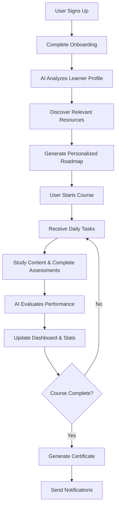
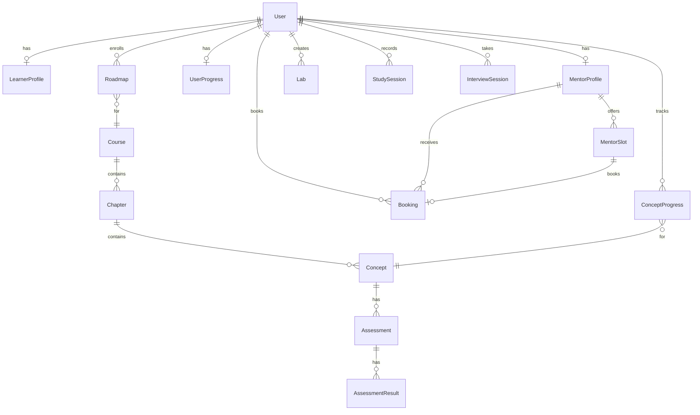

<div align="center">
  
  
  # 🎓 SkillMeter AI
  
  ### **AI-Powered Personalized Learning Platform**
  
  *Transforming unstructured free online educational content into a structured, goal-oriented, and assessment-driven learning experience.*

  [](https://reactjs.org/)
  [](https://vitejs.dev/)
  [](https://djangoproject.com/)
  [](https://tailwindcss.com/)
  [](https://ai.google.dev/)
  [](https://python.org/)
  [](https://sqlite.org/)
  [](LICENSE)

</div>

---

## 📋 Table of Contents

1. [What is SkillMeter AI?](#-what-is-skillmeter-ai)
2. [Solution Overview](#-solution-overview)
3. [Platform Workflow](#-platform-workflow)
4. [Key Features](#-key-features)
5. [Complete Tech Stack](#-complete-tech-stack)
6. [Project Structure](#-project-structure)
7. [Frontend Architecture](#-frontend-architecture)
8. [Backend Architecture](#-backend-architecture)
9. [Database Schema](#-database-schema)
10. [API Endpoints Reference](#-api-endpoints-reference)
11. [AI & External Services](#-ai--external-services)
12. [Feature Deep Dives](#-feature-deep-dives)
13. [Completed Tasks & Development Log](#-completed-tasks--development-log)
14. [Setup & Installation](#-setup--installation)
15. [Environment Variables](#-environment-variables)
16. [Contributing](#-contributing)

---

## 🎯 What is SkillMeter AI?

**SkillMeter AI** is a comprehensive, AI-powered personalized learning platform that transforms unstructured free online educational content into a structured, goal-oriented, and assessment-driven learning experience. The system leverages **Artificial Intelligence** to understand learner profiles, generate customized learning roadmaps, enforce daily study routines, and evaluate learning outcomes through content-based assessments.

### AI Impact Statement

> *In an economy where skill is the new currency, SkillMeterAi is how you prove your net worth.*

### Benefits of SkillMeter AI

| Benefit | Description |
|---------|-------------|
| 📚 **Structured Learning** | Provides structured learning paths from free content |
| 🎯 **Personalization** | Adapts learning to individual needs and skill levels |
| 📊 **Real Assessment** | Measures actual understanding through AI-generated assessments |
| 🔥 **Consistency** | Improves learning consistency and motivation through streaks |
| 📈 **Data-Driven Insights** | Offers data-driven insights into learner progress |

---

## 🔍 Solution Overview

### Key Components of the Solution

#### 2.1 Learner Profiling
- Collects user details such as skill level, prior experience, learning goals, and available study time
- Uses AI to interpret learner input and personalize the learning journey

#### 2.2 AI-Based Content Discovery
- Identifies high-quality free learning resources such as YouTube tutorials and reference materials
- Filters content based on relevance, difficulty level, and learning objectives
- Reduces information overload by selecting only suitable content

#### 2.3 Personalized Roadmap Generation
- Automatically converts selected resources into a structured learning roadmap
- Organizes topics into chapters and concepts with logical sequencing
- Adjusts learning depth based on the learner's proficiency level

#### 2.4 Daily Learning Routine & Task Scheduling
- Generates a day-wise study plan once a course is started
- Assigns clear daily tasks to maintain learning consistency
- Tracks task completion and learning streaks

#### 2.5 AI-Generated Notes and Summaries
- Generates concise, concept-wise notes from learning content
- Highlights key takeaways and important concepts
- Enables quick revision and improved retention

#### 2.6 AI-Based Assessment and Evaluation
- Generates concept-specific assessments using learning content
- Automatically evaluates learner responses
- Provides instant feedback and performance scores
- Ensures learning is outcome-oriented rather than passive

#### 2.7 Progress Tracking and Analytics
- Tracks learning progress, assessment scores, and completion rates
- Visualizes performance through dashboards and charts
- Identifies weak areas and recommends improvement

#### 2.8 Notification and Engagement System
- Sends daily reminders and alerts via email and SMS/WhatsApp
- Notifies users of missed tasks and achievements
- Encourages consistent learning behavior

---

## 🔄 Platform Workflow



### Step-by-Step Flow

1. **User signs up** and completes onboarding questionnaire
2. **Learner profile is analyzed** using AI (skill level, goals, available time)
3. **Relevant learning resources** are discovered via YouTube API
4. A **personalized learning roadmap** is generated using Gemini AI
5. **User starts the course** and receives daily tasks
6. **User studies content** (videos, notes) and completes assessments
7. **AI evaluates performance** and updates dashboard
8. **Notifications reinforce** learning discipline

---

## 🌟 Key Features

### 🤖 AI-Powered Features
| Feature | Description |
|---------|-------------|
| **AI-Generated Roadmaps** | Personalized course structures using Google Gemini AI |
| **Smart Content Discovery** | Automatic YouTube video integration based on topics |
| **AI Notes Generation** | Auto-generated study notes for each concept |
| **Dynamic Quiz Generation** | AI-created assessments with instant feedback |
| **AI Interview Room** | Fullscreen interview experience with Tavus AI avatar and real-time voice interaction |

### 📚 Learning Features
| Feature | Description |
|---------|-------------|
| **Structured Courses** | Chapters, concepts, and lessons in logical sequence |
| **Video Lessons** | Embedded YouTube videos for each concept |
| **Progress Tracking** | Real-time progress bars and completion tracking |
| **Daily Tasks** | Automated task scheduling based on your roadmap |
| **Learning Streaks** | Gamification to maintain consistency |

### 🧠 Focus & Productivity
| Feature | Description |
|---------|-------------|
| **AI Study Room** | Real-time focus tracking using computer vision |
| **Distraction Detection** | MediaPipe-powered head pose analysis |
| **Focus Analytics** | Session statistics and distraction counts |
| **Practice Lab** | Built-in code editor with 12+ language support |

### 🤝 Mentorship & Community
| Feature | Description |
|---------|-------------|
| **Mentor Connect** | Marketplace to find industry experts |
| **Live Sessions** | Video call integration with mentors |
| **Booking System** | Schedule and manage mentor sessions |
| **Mentor Dashboard** | Complete analytics for mentors |

### 📜 Certification & Verification
| Feature | Description |
|---------|-------------|
| **PDF Certificates** | Server-generated certificates with custom design |
| **QR Verification** | Unique QR codes linking to verification page |
| **Public Verification** | Anyone can verify certificate authenticity |
| **Email Delivery** | Automatic certificate delivery via email |

### 🔔 Notifications
| Feature | Description |
|---------|-------------|
| **Email Notifications** | Gmail SMTP integration for alerts |
| **WhatsApp Notifications** | Twilio-powered WhatsApp messages |
| **In-App Notifications** | Real-time notification bell |
| **Notification Logging** | Complete history of all sent notifications |

---

## 🛠 Complete Tech Stack

### Frontend Technologies

| Category | Technology | Version | Purpose |
|----------|------------|---------|---------|
| **Framework** | React | 18.3.1 | UI library for component-based interfaces |
| **Build Tool** | Vite | 5.4.19 | Next-gen frontend build tool with HMR |
| **Routing** | React Router DOM | 6.30.1 | Client-side routing and navigation |
| **State Management** | TanStack Query | 5.83.0 | Server state management and caching |
| **Styling** | TailwindCSS | 3.4.17 | Utility-first CSS framework |
| **Animations** | Framer Motion | 12.26.2 | Complex animations and transitions |
| **Icons** | Lucide React | 0.462.0 | Modern icon library |
| **UI Components** | shadcn/ui | Latest | Radix-based accessible components |
| **Forms** | React Hook Form | 7.61.1 | Performant form management |
| **Validation** | Zod | 3.25.76 | Schema validation |
| **Markdown** | react-markdown | 10.1.0 | Markdown rendering |
| **Charts** | Recharts | 2.15.4 | Data visualization |
| **Toasts** | Sonner | 1.7.4 | Beautiful toast notifications |
| **Code Editor** | Monaco Editor | 0.55.1 | VS Code-based editor |
| **Terminal** | xterm | 5.3.0 | Terminal emulator |
| **Confetti** | canvas-confetti | 1.9.4 | Celebration effects |
| **Date Handling** | date-fns | 3.6.0 | Date utility library |
| **HTTP Client** | Axios | 1.13.2 | Promise-based HTTP client |

### Computer Vision & AI (Frontend)

| Library | Version | Purpose |
|---------|---------|---------|
| **@mediapipe/face_mesh** | 0.4.x | 468-point facial landmark detection |
| **@mediapipe/camera_utils** | 0.3.x | Camera stream management |
| **livekit-client** | 2.17.0 | WebRTC video/audio for interviews |

### Backend Technologies

| Category | Technology | Version | Purpose |
|----------|------------|---------|---------|
| **Framework** | Django | 5.2.10 | Python web framework |
| **API** | Django REST Framework | Latest | RESTful API toolkit |
| **ASGI Server** | Daphne | Latest | WebSocket support |
| **WebSockets** | Django Channels | Latest | Real-time communication |
| **Auth** | SimpleJWT | Latest | JWT authentication |
| **CORS** | django-cors-headers | Latest | Cross-origin requests |
| **Database** | SQLite3 | 3 | Development database |
| **PDF Generation** | ReportLab | Latest | PDF certificate creation |
| **QR Codes** | qrcode | Latest | QR code generation |
| **Image Processing** | Pillow | Latest | Image manipulation |

### External APIs & Services

| Service | Purpose |
|---------|---------|
| **Google Gemini AI** | Content generation, quiz creation, interview AI |
| **YouTube Data API v3** | Video search and content discovery |
| **Twilio** | WhatsApp and SMS notifications |
| **Gmail SMTP** | Email delivery |
| **Piston API** | Code execution (12+ languages) |

| **LiveKit** | WebRTC video rooms (planned) |
| **DiceBear** | Avatar generation |

---

## 📂 Project Structure

```
SkillMeterAi/
├── 📁 src/                          # Frontend Source Code
│   ├── 📁 api/                      # API Client & Services
│   │   ├── api.js                   # Axios instance with JWT interceptors
│   │   ├── labs.js                  # Practice Lab API calls
│   │   └── piston.js                # Code execution API (12 languages)
│   │
│   ├── 📁 components/               # Reusable UI Components
│   │   ├── 📁 chat/                 # Chat components (reserved)
│   │   ├── 📁 dashboard/            # Dashboard-specific components
│   │   │   ├── BookingModal.jsx     # Mentor booking modal
│   │   │   └── ContributionGraph.jsx # GitHub-style activity graph
│   │   ├── 📁 ide/                  # Code Editor components
│   │   │   ├── CodeEditor.jsx       # Monaco editor wrapper
│   │   │   ├── FocusPanel.jsx       # AI focus tracking panel
│   │   │   ├── LabSidebar.jsx       # Lab file management
│   │   │   ├── LanguageSelector.jsx # Language dropdown
│   │   │   ├── LivePreview.jsx      # HTML/CSS preview
│   │   │   └── Output.jsx           # Code execution output
│   │   ├── 📁 layout/               # Layout components
│   │   │   ├── DashboardLayout.jsx  # Main app layout with sidebar
│   │   │   ├── Footer.jsx           # Site footer
│   │   │   ├── Header.jsx           # Top navigation bar
│   │   │   └── PublicLayout.jsx     # Layout for public pages
│   │   ├── 📁 ui/                   # 55+ shadcn/ui components
│   │   │   ├── button.jsx           # Button component
│   │   │   ├── card.jsx             # Card component
│   │   │   ├── dialog.jsx           # Modal dialogs
│   │   │   ├── particles.jsx        # Particle effects
│   │   │   ├── retro-grid.jsx       # Background grid
│   │   │   ├── letter-swap.jsx      # Text animation
│   │   │   ├── rocket-launch.jsx    # Rocket animation
│   │   │   ├── review-form.jsx      # Testimonial form
│   │   │   ├── twitter-testimonial-cards.jsx
│   │   │   └── ... (50+ more)
│   │   ├── Certificate.jsx          # Certificate display
│   │   ├── NavLink.jsx              # Navigation link
│   │   └── ProtectedRoute.jsx       # Auth route wrapper
│   │
│   ├── 📁 contexts/                 # React Context Providers
│   │   ├── AuthContext.jsx          # Authentication state & JWT handling
│   │   └── LearningContext.jsx      # Learning data & progress state
│   │
│   ├── 📁 data/                     # Static data (reserved)
│   │
│   ├── 📁 hooks/                    # Custom React Hooks
│   │   ├── use-toast.js             # Toast notifications
│   │   └── useInterviewWebSocket.js # WebSocket hook for interviews
│   │
│   ├── 📁 lib/                      # Utility functions
│   │   └── utils.js                 # cn(), tailwind-merge helpers
│   │
│   ├── 📁 pages/                    # 21 Route Pages
│   │   ├── Dashboard.jsx            # Main dashboard with stats
│   │   ├── GeminiLiveLab.jsx        # Gemini Live testing page
│   │   ├── Index.jsx                # Root redirect
│   │   ├── InterviewRoom.jsx        # Fullscreen AI Interview Room with Tavus avatar
│   │   ├── Landing.jsx              # Public landing page
│   │   ├── Learn.jsx                # Video + Notes + Quiz learning page
│   │   ├── Login.jsx                # Login form
│   │   ├── MeetingRoom.jsx          # Live mentor meeting room
│   │   ├── MentorConnect.jsx        # Mentor marketplace + Interview launcher
│   │   ├── MentorDashboard.jsx      # Mentor analytics dashboard
│   │   ├── NotFound.jsx             # 404 page
│   │   ├── Notifications.jsx        # Notification center
│   │   ├── Onboarding.jsx           # User onboarding flow
│   │   ├── PracticeLab.jsx          # Code playground
│   │   ├── Profile.jsx              # User profile settings
│   │   ├── Progress.jsx             # Progress analytics
│   │   ├── Roadmap.jsx              # Learning roadmap view
│   │   ├── Settings.jsx             # App settings
│   │   ├── Signup.jsx               # Registration form
│   │   ├── StudyRoom.jsx            # AI focus monitoring room
│   │   └── VerifyCertificate.jsx    # Public certificate verification
│   │
│   ├── 📁 types/                    # TypeScript types (reserved)
│   │
│   ├── App.css                      # Global styles
│   ├── App.jsx                      # Root component with routing
│   ├── index.css                    # Tailwind + custom styles
│   └── main.jsx                     # React entry point
│
├── 📁 backend/                      # Django Backend
│   ├── 📁 api/                      # Main API App
│   │   ├── 📁 management/           # Custom Django commands
│   │   ├── 📁 migrations/           # Database migrations
│   │   ├── 📁 static/               # Static assets
│   │   │   └── 📁 images/           # Logo, Rocketboy for certificates
│   │   ├── 📁 utils/                # Utility modules
│   │   │   ├── certificate.py       # PDF generation with QR codes
│   │   │   └── notifications.py     # Email & WhatsApp integration
│   │   ├── __init__.py
│   │   ├── admin.py                 # Django admin configuration
│   │   ├── apps.py                  # App configuration
│   │   ├── consumers.py             # WebSocket consumers
│   │   ├── models.py                # 17 Database models
│   │   ├── routing.py               # WebSocket routing
│   │   ├── serializers.py           # DRF serializers
│   │   ├── services.py              # AI & external services
│   │   ├── tests.py                 # Unit tests
│   │   ├── urls.py                  # API URL patterns (80+ endpoints)
│   │   └── views.py                 # API views (1100+ lines)
│   │
│   ├── 📁 backend/                  # Django Project Config
│   │   ├── __init__.py
│   │   ├── asgi.py                  # ASGI config for WebSockets
│   │   ├── settings.py              # Django settings
│   │   ├── urls.py                  # Root URL configuration
│   │   └── wsgi.py                  # WSGI config
│   │
│   ├── .env                         # Environment variables
│   ├── db.sqlite3                   # SQLite database
│   ├── manage.py                    # Django CLI
│   └── (various utility scripts)
│
├── 📁 public/                       # Public static assets
│   └── logo.png                     # SkillMeter logo
│
├── 📁 dist/                         # Production build output
│
├── .gitignore                       # Git ignore rules
├── bun.lockb                        # Bun lock file
├── components.json                  # shadcn/ui config
├── eslint.config.js                 # ESLint configuration
├── index.html                       # HTML entry point
├── package.json                     # NPM dependencies
├── package-lock.json                # NPM lock file
├── postcss.config.js                # PostCSS config
├── README.md                        # This file
├── SKILL.md                         # Design skill instructions
├── tailwind.config.js               # Tailwind configuration
└── vite.config.js                   # Vite configuration
```

---

## 🎨 Frontend Architecture

### Application Flow

```
App.jsx
├── QueryClientProvider (TanStack Query)
├── AuthProvider (Authentication Context)
├── LearningProvider (Learning Data Context)
├── TooltipProvider
├── Toaster (Radix Toast)
├── Sonner (Toast notifications)
└── BrowserRouter
    └── Routes
        ├── Public Routes
        │   ├── / → Landing.jsx
        │   ├── /login → Login.jsx
        │   ├── /signup → Signup.jsx
        │   ├── /onboarding → Onboarding.jsx
        │   └── /verify → VerifyCertificate.jsx
        └── Protected Routes
            ├── /dashboard → Dashboard.jsx
            ├── /roadmap → Roadmap.jsx
            ├── /learn → Learn.jsx
            ├── /progress → Progress.jsx
            ├── /notifications → Notifications.jsx
            ├── /profile → Profile.jsx
            ├── /practice-lab → PracticeLab.jsx
            ├── /study-room → StudyRoom.jsx
            ├── /mentor-connect → MentorConnect.jsx
            ├── /mentor/dashboard → MentorDashboard.jsx
            ├── /room/:roomId → MeetingRoom.jsx
            └── /settings → Settings.jsx
```

### Key React Components

#### Authentication Context (`AuthContext.jsx`)
- JWT token management with automatic refresh
- User state persistence in localStorage
- `authFetch` helper for authenticated API calls
- Login, Signup, Logout functions
- Onboarding completion tracking

#### Learning Context (`LearningContext.jsx`)
- Course and roadmap data management
- Progress tracking and updates
- Daily task management
- Notification handling
- Assessment submission

### UI Component Library

The project uses **55+ shadcn/ui components** built on Radix UI primitives:

| Category | Components |
|----------|------------|
| **Layout** | Card, Separator, Scroll Area, Resizable Panels |
| **Forms** | Button, Input, Textarea, Select, Checkbox, Radio, Switch, Slider |
| **Feedback** | Toast, Alert, Badge, Progress, Skeleton |
| **Overlay** | Dialog, Drawer, Sheet, Popover, Tooltip, Hover Card |
| **Navigation** | Tabs, Accordion, Collapsible, Navigation Menu, Menubar |
| **Data Display** | Table, Avatar, Calendar, Chart |
| **Custom** | Particles, Retro Grid, Letter Swap, Rocket Launch |

### Design System

The project follows a **Neo-Brutalist** design aesthetic with:

- **Colors**: High contrast black/white with vibrant accents
- **Typography**: Bold heading fonts, clean body text
- **Shadows**: Hard-edged box shadows (`shadow-[6px_6px_0px_0px_#000]`)
- **Borders**: 2px black borders with no border-radius (`rounded-none`)
- **Animations**: Framer Motion for page transitions and micro-interactions

---

## 🐍 Backend Architecture

### Django Project Structure

```
backend/
├── backend/           # Project configuration
│   ├── settings.py    # All Django settings
│   ├── urls.py        # Root URL config → includes api.urls
│   ├── asgi.py        # ASGI for WebSocket support
│   └── wsgi.py        # WSGI for HTTP
│
└── api/               # Main application
    ├── models.py      # 17 database models
    ├── views.py       # 30+ API views
    ├── serializers.py # 15+ DRF serializers
    ├── services.py    # 6 service classes
    ├── consumers.py   # WebSocket consumers
    └── urls.py        # 80+ URL patterns
```

### Service Layer Architecture

#### `services.py` - AI & External Services

| Service Class | Purpose |
|---------------|---------|
| `YouTubeService` | Searches YouTube for relevant videos |
| `ContentDiscoveryService` | Generates complete course structures using Gemini |
| `NotesGeneratorService` | Creates AI-generated study notes |
| `QuizGeneratorService` | Generates MCQ assessments |
| `GeminiInterviewService` | Handles mock interview AI logic |
| `LiveKitService` | Manages WebRTC video tokens |


### Authentication System

- **JWT Authentication** via `djangorestframework-simplejwt`
- **Token Rotation**: Access tokens (60 min), Refresh tokens (7 days)
- **Blacklisting**: Logout invalidates refresh tokens
- **Auto-refresh**: Frontend automatically refreshes expired tokens

---

## 📊 Database Schema

### Complete Model Reference (17 Models)

#### User & Profile Models

```python
# LearnerProfile - Student profile with learning preferences
LearnerProfile:
    - user (OneToOne → User)
    - skill_level (beginner/intermediate/advanced)
    - learning_goals (JSONField)
    - daily_study_time (minutes)
    - phone_number (for WhatsApp)
    - onboarding_completed (boolean)

# MentorProfile - Mentor profile with expertise
MentorProfile:
    - user (OneToOne → User)
    - title (e.g., "Senior SDE @ Google")
    - company
    - hourly_rate
    - about
    - skills (JSONField)
    - availability (JSONField)
    - is_verified
    - total_earnings
    - average_rating
```

#### Course & Content Models

```python
# Course - Learning course container
Course:
    - title
    - description
    - thumbnail (URL)
    - difficulty
    - estimated_hours
    - tags (JSONField)

# Chapter - Section within a course
Chapter:
    - course (ForeignKey → Course)
    - title
    - description
    - order

# Concept - Individual lesson/topic
Concept:
    - chapter (ForeignKey → Chapter)
    - title
    - description
    - duration (minutes)
    - video_url
    - notes (Markdown)
    - content_type (video/article/exercise)
    - order
```

#### Progress & Assessment Models

```python
# Roadmap - User enrollment with progress
Roadmap:
    - user (ForeignKey → User)
    - course (ForeignKey → Course)
    - progress (0-100%)
    - current_chapter
    - current_concept
    - started_at
    - last_accessed_at
    - completed_at
    - certificate_id (unique hash)

# ConceptProgress - Individual concept completion
ConceptProgress:
    - user (ForeignKey → User)
    - concept (ForeignKey → Concept)
    - completed
    - completed_at

# Assessment - Quiz for a concept
Assessment:
    - concept (ForeignKey → Concept)
    - questions (JSONField)
    - time_limit

# AssessmentResult - User's quiz submission
AssessmentResult:
    - user (ForeignKey → User)
    - assessment (ForeignKey → Assessment)
    - score
    - answers (JSONField)
    - completed_at
```

#### Engagement Models

```python
# DailyTask - Scheduled learning task
DailyTask:
    - user (ForeignKey → User)
    - concept (ForeignKey → Concept)
    - task_type (video/notes/assessment)
    - title
    - scheduled_date
    - completed

# Notification - User notification
Notification:
    - user (ForeignKey → User)
    - notification_type (reminder/achievement/missed/system)
    - title
    - message
    - read
    - created_at

# NotificationLog - Sent notification history
NotificationLog:
    - user (ForeignKey → User)
    - notification_type (EMAIL/WHATSAPP)
    - event_name
    - recipient
    - status (SENT/FAILED)
    - error_message
    - created_at

# UserProgress - Overall learning stats
UserProgress:
    - user (OneToOne → User)
    - total_minutes_learned
    - total_concepts_completed
    - total_assessments_taken
    - average_score
    - current_streak
    - longest_streak
    - last_activity_date
```

#### Feature-Specific Models

```python
# Lab - Saved code playground
Lab:
    - user (ForeignKey → User)
    - name
    - language
    - files (JSONField)
    - created_at
    - updated_at

# StudySession - Focus tracking session
StudySession:
    - user (ForeignKey → User)
    - started_at
    - ended_at
    - total_duration (seconds)
    - focus_duration (seconds)
    - distraction_count
    - focus_percentage

# MentorSlot - Mentor availability
MentorSlot:
    - mentor (ForeignKey → MentorProfile)
    - start_time
    - end_time
    - is_booked

# Booking - Mentor session booking
Booking:
    - learner (ForeignKey → User)
    - mentor (ForeignKey → MentorProfile)
    - slot (OneToOne → MentorSlot)
    - status (PENDING/CONFIRMED/COMPLETED/CANCELLED)
    - meeting_link
    - topic
    - amount_paid
    - payment_id

# InterviewSession - Mock interview record
InterviewSession:
    - user (ForeignKey → User)
    - topic
    - difficulty
    - duration
    - score
    - feedback
    - strengths (JSONField)
    - weaknesses (JSONField)
    - transcript
    - created_at
    - completed_at
```

### Entity Relationship Diagram



---

## 🔌 API Endpoints Reference

### Authentication Endpoints

| Method | Endpoint | Description |
|--------|----------|-------------|
| `POST` | `/api/auth/register/` | User registration |
| `POST` | `/api/auth/login/` | User login (email/username) |
| `POST` | `/api/auth/logout/` | Logout (blacklist token) |
| `POST` | `/api/auth/refresh/` | Refresh access token |
| `GET/PUT` | `/api/auth/user/` | Current user profile |

### Profile Endpoints

| Method | Endpoint | Description |
|--------|----------|-------------|
| `GET/PUT` | `/api/profile/` | Learner profile |
| `GET` | `/api/progress/` | User learning statistics |
| `GET` | `/api/activity/` | Activity log (contribution graph data) |

### Course & Learning Endpoints

| Method | Endpoint | Description |
|--------|----------|-------------|
| `GET` | `/api/courses/` | List all courses |
| `GET` | `/api/courses/{id}/` | Course details with chapters |
| `GET/POST` | `/api/roadmaps/` | List/create user roadmaps |
| `POST` | `/api/roadmaps/generate/` | AI-generate new roadmap |
| `GET/PUT/DELETE` | `/api/roadmaps/{id}/` | Roadmap details |
| `GET` | `/api/roadmaps/{id}/certificate/` | Download certificate PDF |
| `POST` | `/api/concepts/{id}/complete/` | Mark concept complete |
| `POST` | `/api/concepts/{id}/generate-notes/` | AI-generate notes |
| `POST` | `/api/concepts/{id}/generate-quiz/` | AI-generate quiz |

### Assessment Endpoints

| Method | Endpoint | Description |
|--------|----------|-------------|
| `GET` | `/api/assessments/{id}/` | Get assessment questions |
| `POST` | `/api/assessments/{id}/submit/` | Submit assessment answers |

### Task & Notification Endpoints

| Method | Endpoint | Description |
|--------|----------|-------------|
| `GET` | `/api/tasks/` | Today's tasks |
| `POST` | `/api/tasks/{id}/complete/` | Mark task complete |
| `GET` | `/api/notifications/` | All notifications |
| `POST` | `/api/notifications/{id}/read/` | Mark as read |

### Lab & Study Session Endpoints

| Method | Endpoint | Description |
|--------|----------|-------------|
| `GET/POST` | `/api/labs/` | List/create labs |
| `GET/PUT/DELETE` | `/api/labs/{id}/` | Lab details |
| `GET/POST` | `/api/study-sessions/` | List/create study sessions |
| `GET` | `/api/study-sessions/stats/` | Focus statistics |

### Mentor & Booking Endpoints

| Method | Endpoint | Description |
|--------|----------|-------------|
| `GET/POST` | `/api/mentors/` | List mentors / Become mentor |
| `GET` | `/api/mentors/{id}/` | Mentor details |
| `POST` | `/api/bookings/request/` | Request mentor session |
| `GET` | `/api/bookings/my-sessions/` | Learner's bookings |
| `GET` | `/api/bookings/mentor-sessions/` | Mentor's bookings |
| `POST` | `/api/bookings/{id}/status/` | Update booking status |

### Mentor Dashboard Endpoints

| Method | Endpoint | Description |
|--------|----------|-------------|
| `GET` | `/api/mentor/stats/` | Mentor dashboard statistics |
| `GET/POST` | `/api/mentor/availability/` | Manage availability slots |
| `GET` | `/api/mentor/payments/` | Payment history |

### Public Endpoints

| Method | Endpoint | Description |
|--------|----------|-------------|
| `GET` | `/api/hello/` | Health check |
| `GET` | `/api/leaderboard/` | Top 5 learners |
| `GET` | `/api/trending/` | Trending topics |
| `GET` | `/api/certificates/verify/{id}/` | Verify certificate |

### WebSocket Endpoints

| Endpoint | Messages | Description |
|----------|----------|-------------|
| `ws://host/ws/interview/` | `INIT_SESSION`, `USER_ANSWER`, `END_SESSION` | Mock interview real-time communication |

---

## 🤖 AI & External Services

### Google Gemini AI Integration

**Model Used**: `gemini-3-flash-preview`

#### Content Discovery Service
```python
# Generates complete course structure
ContentDiscoveryService.search_videos(topic, skill_level)
# Returns: { course: {...}, chapters: [...] }
```

#### Notes Generator Service
```python
# Creates study notes for a video
NotesGeneratorService.generate_notes(video_title, context)
# Returns: Markdown formatted notes
```

#### Quiz Generator Service
```python
# Generates MCQ assessment
QuizGeneratorService.generate_quiz(topic, notes)
# Returns: [{ question, options, correctAnswer, explanation }]
```

#### Interview Service
```python
# Generates interview questions
GeminiInterviewService.generate_question(topic, level, duration, history)
# Analyzes interview performance
GeminiInterviewService.analyze_interview(topic, transcript)
```

### YouTube Data API v3

```python
YouTubeService.search_video(query)
# Returns: { video_url, thumbnail }
# Fallback: YouTube search URL if quota exceeded
```

### Twilio Integration

```python
# Email notifications
send_email_notification(user, subject, message, attachment=None)

# WhatsApp notifications
send_whatsapp_notification(user, message_body)
```

### Piston API (Code Execution)

Supports **12 programming languages**:
- JavaScript (18.15.0)
- TypeScript (5.0.3)
- Python (3.10.0)
- Java (15.0.2)
- C# (6.12.0)
- PHP (8.2.3)
- C (10.2.0)
- C++ (10.2.0)
- Go (1.16.2)
- Rust (1.68.2)
- Ruby (3.0.1)
- Kotlin (1.8.20)
- HTML/CSS (Preview only)

---

## 🔬 Feature Deep Dives

### 🧠 AI Study Room

**File**: `src/pages/StudyRoom.jsx`, `src/components/ide/FocusPanel.jsx`

A "Proctoring-lite" feature that helps users maintain focus during study sessions using computer vision.

#### Technology Stack
- **MediaPipe Face Mesh**: 468 facial landmark detection
- **WebGL**: Real-time canvas rendering
- **Web Audio API**: Distraction alert sounds

#### How It Works
1. Camera captures user's face in real-time
2. MediaPipe detects 468 facial landmarks
3. Head pose calculated from nose/eye positions
4. Direction determined: Forward, Left, Right, Up, Down
5. Distraction triggered if looking away (Left/Right/Up)
6. Looking Down allowed (for note-taking)
7. Audio + visual alerts on distraction

#### Metrics Tracked
- **Total Time**: Session duration
- **Focus Time**: Time spent looking forward/down
- **Focus Percentage**: focus_time / total_time × 100
- **Distraction Count**: Number of distraction events

### 🎤 Mock Interview Simulator

**Files**: `src/pages/MentorConnect.jsx`, `src/hooks/useInterviewWebSocket.js`, `backend/api/consumers.py`

An interactive AI interviewer that conducts realistic technical and behavioral interviews.

#### Architecture
```
Frontend (React)                    Backend (Django)
┌──────────────────┐               ┌──────────────────┐
│ MentorConnect.jsx│               │InterviewConsumer │
│                  │ WebSocket     │                  │
│ ┌──────────────┐ │<───────────> │ ┌──────────────┐ │
│ │ Speech-to-   │ │               │ │ Gemini AI    │ │
│ │ Text API     │ │               │ │ Service      │ │
│ └──────────────┘ │               │ └──────────────┘ │
│                  │               │                  │
│ ┌──────────────┐ │               │ ┌──────────────┐ │
│ │ Webcam Feed  │ │               │ │ LiveKit      │ │
│ └──────────────┘ │               │ │ Service      │ │
└──────────────────┘               └──────────────────┘
```

#### WebSocket Message Flow
1. `INIT_SESSION` → Creates interview, returns opening question
2. `USER_ANSWER` → Processes answer, returns next question
3. `END_SESSION` → Analyzes transcript, returns performance report

#### AI Interviewer Persona
- **Name**: Alex
- **Role**: Senior Technical Interviewer at top tech company
- **Style**: Professional, direct, rigorous
- **Topics**: React, Node.js, System Design, Behavioral, DSA

### 📜 Certificate Verification System

**Files**: `backend/api/utils/certificate.py`, `src/pages/VerifyCertificate.jsx`

Tamper-proof certificates with QR code verification.

#### Certificate Generation
1. User completes 100% of roadmap
2. Backend generates SHA-256 based certificate ID
3. ReportLab creates PDF with:
   - Decorative border
   - SkillMeter logo
   - User name and course title
   - Completion date
   - QR code linking to verification URL
4. PDF emailed + WhatsApp notification sent

#### Verification Flow
1. Anyone can scan QR or visit `/verify?id=CERT_ID`
2. Backend verifies certificate exists and is valid
3. Returns student name, course, completion date
4. Frontend displays verification result

### 🤝 Mentor Connect Platform

**Files**: `src/pages/MentorConnect.jsx`, `src/pages/MentorDashboard.jsx`

Full-featured mentor marketplace with booking system.

#### For Learners
- Browse verified mentors with skills, ratings, pricing
- View mentor availability calendar
- Book sessions with topic and time selection
- Track booking status (Pending → Confirmed → Completed)
- Join live video meetings

#### For Mentors
- Dashboard with earnings, sessions, ratings
- Manage availability slots
- Accept/decline booking requests
- View session history
- Track payment transactions

### 💻 Practice Lab (Code Playground)

**Files**: `src/pages/PracticeLab.jsx`, `src/components/ide/*`

Full-featured code editor supporting 12 programming languages.

#### Features
- Monaco Editor (VS Code engine)
- Syntax highlighting for all languages
- Real-time code execution via Piston API
- Multi-file support
- HTML/CSS live preview
- Lab saving and management
- Focus monitoring integration

---

## ✅ Completed Tasks & Development Log

### Study Room Feature
- [x] Install MediaPipe dependencies
- [x] Create `StudyRoom.jsx` page component
- [x] Add route to App.jsx and sidebar navigation
- [x] Implement face mesh visualization (contours, eyes, iris)
- [x] Create `StudySession` model and API endpoints
- [x] Refine distraction logic (Down = Allowed, Left/Right/Up = Distracted)
- [x] Fix distraction counting (state staleness issue)
- [x] Implement 4-beep audio alerts on distraction
- [x] Integrate session saving to database

### Notification System
- [x] Install Twilio package
- [x] Configure settings for Email & Twilio
- [x] Create `NotificationLog` model
- [x] Create `notifications.py` utility service
- [x] Integrate notifications into `mark_concept_complete` view
- [x] Integrate notifications into `generate_certificate` view
- [x] Verify Email and WhatsApp sending
- [x] Auto-assign WhatsApp phone for all users

### Certificate Verification System
- [x] Add `certificate_id` to Roadmap model
- [x] Install `qrcode` and implement in certificate.py
- [x] Create `VerifyCertificateView` API
- [x] Create `VerifyCertificate.jsx` frontend page
- [x] Add `completed_at` field to Roadmap model
- [x] Implement Leaderboard & Trending API

### Mentor Connect Feature
- [x] Create `MentorConnect.jsx` with tabbed interface
- [x] Implement "Find Mentors" tab with grid layout
- [x] Implement "Interview Simulator" tab
- [x] Add dynamic scroll layout & header transitions
- [x] Integrate DiceBear avatars & LinkedIn links
- [x] Implement dynamic interview questions by topic
- [x] Create `MentorDashboard.jsx` with full analytics
- [x] Create `BookingModal` with Razorpay UI
- [x] Create `MeetingRoom.jsx` for video calls
- [x] Implement "My Sessions" tab for learners

### Mentor Backend Implementation
- [x] Create `MentorProfile`, `MentorSlot`, `Booking` models
- [x] Create mentor API views and serializers
- [x] Integrate frontend with mentor APIs
- [x] Implement booking flow end-to-end
- [x] Create mentor stats, availability, payments endpoints

### Mock Interview Simulator
- [x] Install channels, daphne, google-genai, livekit-api
- [x] Configure ASGI for WebSocket support
- [x] Create `InterviewConsumer` with full implementation
- [x] Add `InterviewSession` model
- [x] Create `GeminiInterviewService` with persona
- [x] Create `LiveKitService` for WebRTC tokens

- [x] Frontend: Create `useInterviewWebSocket` hook
- [x] Frontend: Integrate WebSocket with simulator UI
- [x] Refine AI system prompt for realistic interviews

### Documentation
- [x] Create comprehensive README.md
- [x] Document all features and APIs
- [x] Create architecture diagrams

---

## 🚀 Setup & Installation

### Prerequisites

- **Node.js** 18+ or **Bun** 1.0+
- **Python** 3.10+
- **pip** or **pipenv**

### Frontend Setup

```bash
# Navigate to project root
cd SkillMeterAi

# Install dependencies
npm install
# OR with Bun
bun install

# Start development server
npm run dev
# OR
bun dev

# Build for production
npm run build
```

### Backend Setup

```bash
# Navigate to backend folder
cd backend

# Create virtual environment (optional but recommended)
python -m venv venv
source venv/bin/activate  # Linux/Mac
.\venv\Scripts\activate   # Windows

# Install Python dependencies
pip install django djangorestframework djangorestframework-simplejwt django-cors-headers channels daphne python-dotenv google-generativeai requests reportlab qrcode pillow twilio

# Run database migrations
python manage.py migrate

# Create superuser (optional)
python manage.py createsuperuser

# Start development server
python manage.py runserver 8001

### 🛡️ Admin Dashboard

The Django admin panel allows you to manage courses, users, and mentors directly.

- **URL**: [http://localhost:8001/admin/](http://localhost:8001/admin/)
- **Default Username**: `admin`
- **Default Password**: `password123`

To create your own superuser:
```bash
python manage.py createsuperuser
```

# OR with WebSocket support
daphne -b 0.0.0.0 -p 8000 backend.asgi:application
```

### Quick Start (Both Servers)

```bash
# Terminal 1: Frontend
npm run dev

# Terminal 2: Backend
cd backend && python manage.py runserver
```

---

## 🔐 Environment Variables

Create a `.env` file in the `backend/` directory:

```env
# AI Services
GEMINI_API_KEY=your_gemini_api_key
YOUTUBE_API_KEY=your_youtube_api_key

# Email Configuration (Gmail SMTP)
EMAIL_HOST_USER=your_email@gmail.com
EMAIL_HOST_PASSWORD=your_app_password

# Twilio (WhatsApp)
TWILIO_ACCOUNT_SID=your_twilio_sid
TWILIO_AUTH_TOKEN=your_twilio_token
TWILIO_WHATSAPP_NUMBER=+14155238886

# LiveKit (Optional - for video calls)
LIVEKIT_API_KEY=your_livekit_key
LIVEKIT_API_SECRET=your_livekit_secret
LIVEKIT_URL=wss://your-livekit-server


```

### Getting API Keys

| Service | How to Get |
|---------|------------|
| **Gemini AI** | [Google AI Studio](https://aistudio.google.com/) |
| **YouTube API** | [Google Cloud Console](https://console.cloud.google.com/) |
| **Twilio** | [Twilio Console](https://console.twilio.com/) |
| **Gmail App Password** | [Google Account Security](https://myaccount.google.com/security) |

---

## 🤝 Contributing

We welcome contributions! Please follow these steps:

1. Fork the repository
2. Create a feature branch (`git checkout -b feature/amazing-feature`)
3. Commit your changes (`git commit -m 'Add amazing feature'`)
4. Push to the branch (`git push origin feature/amazing-feature`)
5. Open a Pull Request

### Code Style

- **Frontend**: ESLint with React hooks rules
- **Backend**: PEP 8 style guide
- **Commits**: Conventional commits preferred

---

## 📄 License

This project is licensed under the MIT License - see the [LICENSE](LICENSE) file for details.

---

<div align="center">
  <p>Built with ❤️ by the SkillMeter AI Team</p>
  <p>
    <a href="#-skillmeter-ai">Back to Top</a>
  </p>
</div>
]]>
